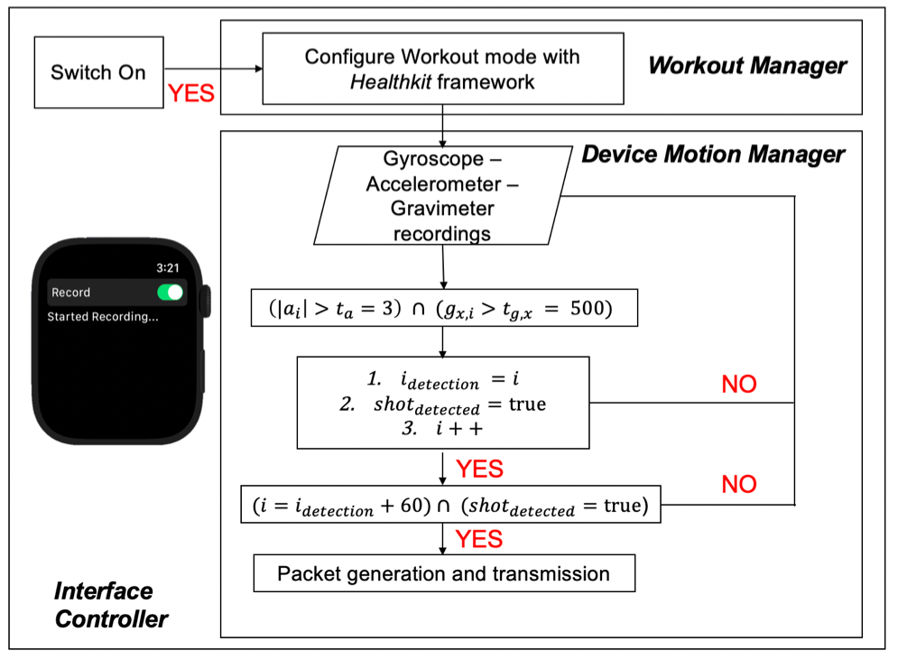

# FYP PROJECT CODE - KARIM EZZEDEEN
## 1. Overall Hierarchy and Organization
The overarching aim of the project is to effectively build a machine learning model to classify the Tennis stroke classes (forehand, backhand, serve, forehand volley, backhand volley) and player level (beginner and novice), as well as assess different player performance parameter to assess shot quality. Another aim of the project is to implement this framework in real time for better coachine assistance and integration to Tennis training session to better visaulize and track player evolution. The project was divided into 2 main subparts:
* MATLAB: The code trial file is responsible of gathering and processing the data signals exported from the Apple iWatch Series 3, and select the most suitable classifier via the "classification learner framework". 
* Swift/Xcode: The code was translated to Xcode in order to create an App in AppleWatch and Iphone to process the signal data and classify the stroke and player level + assess player performance parameter in real-time. 

## 2. MATLAB: Code Trial
### 2.1. Data Processing
The processing of the data was done in several steps:
* Data Collection: Stroke signals were recorded from the iWatch Series 3 and the application "SensorLog". The accelerometer, gravimeter, and gyroscope signals in X, Y, and Z axes were extracted from the collected data for further processing. 
* Shot Detection and Segmentation: Done with the functions segment_x_trial, where x is the sensor name (accelerometer, gyroscope, or gravimeter). All shot detection algorithms were based off the acceleration signal, as the signal peak is expected to be the most representative of the racket-ball impact. The volley extensions of these functions were applied to the volley shots, as they are much shorter and exhibit different peak values than the other stroke classes.
* Pairwise Cross-Correlation Averaging: Done with the ensemble functions final_step_cross_correlation.m, iterative_cross_correlation.m, and cross_correlation_av.m. This is to ensure that all signal peaks are perfectly aligned for cleaner data. 
* Parameter Extaction: Instead of feeding the Classifier with the entire signal (120 sample points/signal), parameter extraction was performed in order to reduce computational power requirements. This was done via the MaxMin_trial.m function. The main parameters extracted are:
  * Max
  * Min
  * Std
  * Mean
  * Area under the curve (trapezium rule)
* The Compile_trial.m and Compile_volley_trial.m functions encompass all the steps above for many files of data. This was done for simplicity and to avoid repeating the steps mentioned 

### 2.2. Training and Testing Data building
The parameters extracted from each of the accelerometer, gyorscope, and gravimeter data (for all stroke classes and player level) were stored in a table and split into training and testing samples. This can be seen in the trial_run.mlx live editor. 

### 2.3.Performance Parameters
To effectively assess player performance and the shot quality, 4 different performance parameters were derived.
* Racket Speed: Done via RacketSpeed.m function (result in km/h).
* Shot consistency: Each shot gyroscope signal was compared to a template shot (generated by template_shots.m) by calculating a euclidian distance. A lower distance means a better shot consitency. The euclidian distance values were computed via the consistency_evaluation.m function. 
* Hit/Miss: The differentiation of Hits and Misses was performed from different parameters computed in the features_misses.m function, and verified in the Misses.mlx live editor. Only accelerometer signals were analysed for this, as this is expected to yield larger difference due to the absence of the ball-racket impact. It should also be noted that this analysis was compelted for forehands and backhands only.
* Follow-through: Same as Hit/Miss via the followthrough.m function and verfied in the FollowThrough.mlx live editor. 

## 3. Xcode: TENNIS MOTION
The code files hierarchy and the role of each code files will be presented in form of workflow diagrams for both the iWatch and the iPhone. The main role of the iWatch is to record the data with the 3 sensors mentioned, detect and segmend a shot, followed by the transmission of the shot data packet to the iPhone. On the other hand, the iPhone will be responsible for feature extraction, stroke type and player level classifications, as well as performance parameter derivations. 
### 3.1. iWatch

### 3.2. iPhone

